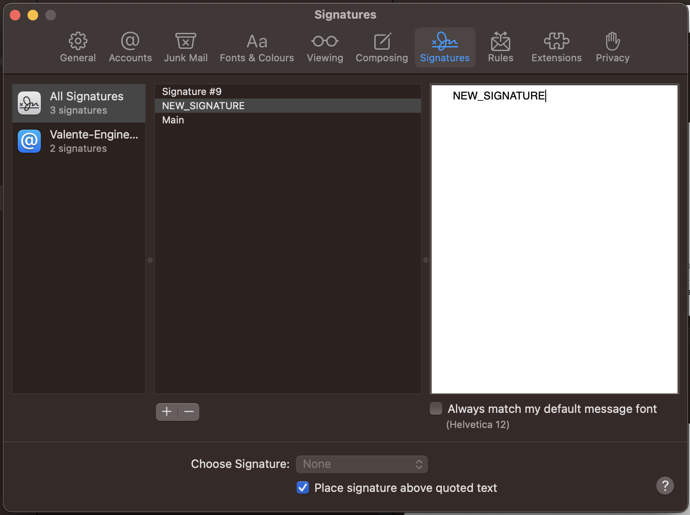
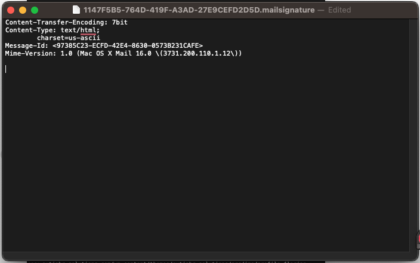
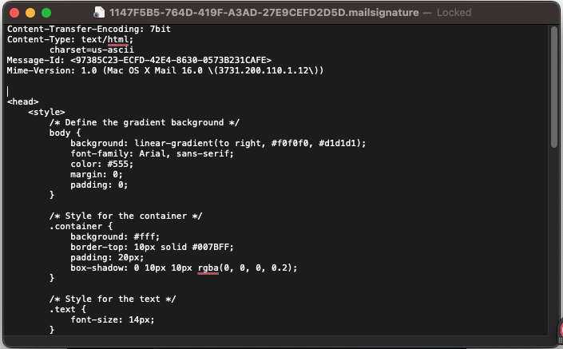

# AppleMail.Signiture
A repo for your custom build Apple.Mail signature.

Knowing the basics of software developemnt and how to access commands and controls can take you to some strange places. I had this issue recently trying to create a 'signature' with the Mail App on my Macbook. 

There are various websites that allow you to create signatures that can be added to your signature selector in the App. The problem arrises when you come to import them, however. They never seem to work correctly once imported, be it links broken, styles not working and layout going bananas! 🍌 

It took some time, but I figured a way to access the 'signatures' files directly, then import my own custom HTML code for each file, then lock the files so that the text compiler in the Mail App doesn't try to warp the code!

Follow the instructions below to make your own...! 


### Step 1
## Create a new Signature
<ul>
<li>In Apple Mail, open ```Settings...``` > ```Signatures```.</li>
<li>Select your email account in the left column.</li>
<li>Now create a new signature by clicking on ```+``` icon.</li>
<li>Name the new Signature 'NEW_SIGNATURE'.</li>
<li>Make sure the ```Always match my default font``` checkbox is ```off```.</li>
<li>Close the ```Settings``` window then close Apple Mail by right-clicking on the screen bottom Icon and selecting ```Quit```.</li>
</ul>


### Step 2
## Open a new TextEdit doc
<li>
Use the splotlight search function on your Mac ```Command``` + ```Spacebar``` to open ```TextEdit```
Select ```New Document``` which will open a new file.
Select TextEditor ```Settings...``` in the drop down menu and navigate to the ```Open and Save``` section
Make sure that the ```Display HTML files as HTML code instead of formatted text``` is ticked.
Close the ```Preferences``` window.
</li>

# This is where the magic happens!...
The next step will locate our new signature file from the Apple Mail App. Now, it must be stated that Apple has dileberatly made these files private so they wont appear in your regular ```Finder``` searches. This is beacuase the enclosed files are not meant to be editable by regular users for fear of writing bugs in the App can't read!

### Step 3
## Locate and Open the hidden 'NEW_SIGNATURE' file
<li>
Navigate to your home desktop screen and select the ```Go``` drop down menu then ```Go to Folder```.
Type in to the search window ```~/Library/Mail/V10/MailData/Signatures``` then Enter.
</li>
# Note: The Version may change over time, so the V(number) may be different. You can use the menu below to select where you want to go using your current version.
<li>
In the new (hidden) folder, you should be able to see a number of files that hold your Signatures. Right click on each and ```Open With``` the ```TextEdit``` App.
</li>
# Note: look at the ```Date Modified``` column to see which one you just created```
<li>
The File we want should have '>NEW_SIGNATURE<' at the bottom in the <body> tags.
Go ahead and delete the Entire <body> tags and everything in it, leaving just the top Content and Version information at the top.

</li>

### Step 4
## Create the New Design and Test it
<li>
Paste your custom design into the Signature file in HTML format.
Remove the <!DOCTYPE html> and the <html> tags - Top and bottom!

Close the ```TextEdit``` app and in the 'hidden' Signatures folder, right click the same file and select ```Get info```
This will open a new window for the file details. Make sure the ```Locked``` box is ticked ✅ 

Then, open up your Apple Mail App again and click to create a new email
The ```NEW_SIGNATURE``` should be there and will now render your new footer to the bottom of the page!
</li>